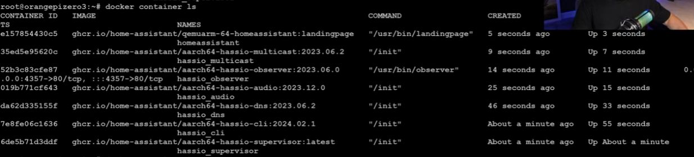

# Referencia de Instação: 

Video: https://www.youtube.com/watch?v=VvHY78M17z4&t=649s

Git Manual: https://github.com/home-assistant/supervised-installer

Já intalado em um Orange Pi 3 LTS e 3B 

# Instalação Home Assistant Supervised

Este método de instalação fornece a experiência completa do Home Assistant em um sistema operacional normal. Isso significa que todos os componentes do método Home Assistant são usados, exceto o Home Assistant Operating System. Este sistema irá executar o Home Assistant Supervisor. O Supervisor não é apenas um aplicativo, é um appliance completo que gerencia todo o sistema. Ele limpará, reparará ou redefinirá as configurações para o padrão se elas não corresponderem mais aos valores esperados.

Ao não usar o Sistema Operacional Home Assistant, o usuário é responsável por garantir que todos os componentes necessários sejam instalados e mantidos. Os componentes necessários e suas versões serão alterados com o tempo. O Home Assistant Supervised é fornecido no estado em que se encontra como base para soluções do tipo "faça você mesmo" apoiadas pela comunidade. Nós só aceitamos relatórios de bugs para problemas que foram reproduzidos em um Debian recém-instalado e totalmente atualizado, sem pacotes adicionais.

Este método é considerado avançado e só deve ser usado se for um especialista em gerenciar um sistema operacional Linux, Docker e rede.

## Instalação

Execute os seguintes comandos como root (`su -` or `sudo su -` em máquinas com sudo instalado):

Etapa 1: Instale as seguintes dependências com este comando:

```bash
apt install \
apparmor \
cifs-utils \
curl \
dbus \
jq \
libglib2.0-bin \
lsb-release \
network-manager \
nfs-common \
systemd-journal-remote \  
systemd-resolved \ (Esse na hora da instalação deu erro pulamos essta etapa)
udisks2 \
wget -y
```

Etapa 2: Instale o Docker-CE com o seguinte comando:

```bash
curl -fsSL get.docker.com | sh
```

Etapa 3: Instale o OS-Agent:

Instruções para instalar o OS-Agent podem ser encontradas [here] Referencia (https://github.com/home-assistant/os-agent/tree/main#using-home-assistant-supervised-on-debian)

Seguir o Manual Ha-OS.md


Passo 4: Instale o pacote Debian supervisionado pelo Home Assistant:

```bash
wget -O homeassistant-supervised.deb https://github.com/home-assistant/supervised-installer/releases/latest/download/homeassistant-supervised.deb
apt install ./homeassistant-supervised.deb
```

## Tipos de máquina suportados

- generic-x86-64
- odroid-c2
- odroid-c4
- odroid-n2
- odroid-xu
- qemuarm
- qemuarm-64  (no Orange Pi Usar essa opção)
- qemux86
- qemux86-64
- raspberrypi
- raspberrypi2
- raspberrypi3
- raspberrypi4
- raspberrypi3-64
- raspberrypi4-64
- raspberrypi5-64
- tinker
- khadas-vim3

## Comanda para verificar se o Home Assistant esta OK

```bash
docker container ls
```


Tem que ter 7 container! 
